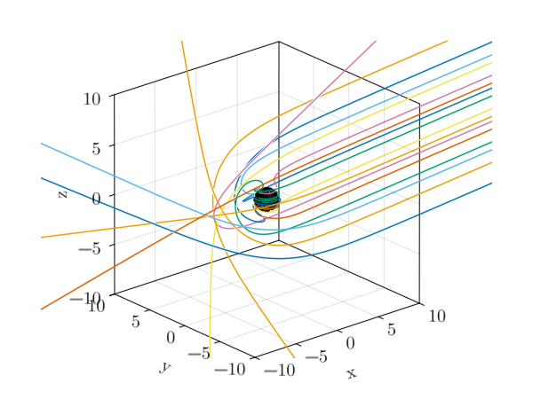

# Rays parameterized with Mino time {#Rays-parameterized-with-Mino-time}

In this example, we will raytrace the region around a Kerr blackhole as seen by an observer stationed at infinity. We will show the emission coordinates of the n=0 (direct) and n=1 (indirect) photons as they are emitted from the source, at a fixed inclination angle from the blackhole&#39;s spin axis.

First, let&#39;s import Krang and CairoMakie for plotting.

```julia
using Krang
import GLMakie as GLMk
GLMk.Makie.inline!(true)
```


```
true
```


We will use a 0.99 spin Kerr blackhole viewed by an assymptotic observer at an inclination angle of θo=π/4. A region spanned by radii between the horizon and 20M at varying inclinations will be raytraced onto the 20Mx20M screen of the observer.

```julia
metric = Krang.Kerr(0.99); # Kerr spacetime with 0.99 spin
θo = 85 * π / 180; # Observer inclination angle with respect to spin axis
sze = 200; # Number of pixels along each axis of the screen
rmin = Krang.horizon(metric); # Minimal radius to raytrace
rmax = 10; # Maximal radius to raytrace
ρmax = 5; # Size of the screen
```


We will define a camera with the above parameters. The SlowLightIntensityCamera pre-calculates information about the spacetime and the observer&#39;s screen to speed up the raytracing for slowlight applications.

```julia
camera = Krang.SlowLightIntensityCamera(metric, θo, -ρmax, ρmax, -ρmax, ρmax, sze);
```


Let us now create a figure to plot the emission coordinates on,

```julia
curr_theme = GLMk.Theme(# Makie theme
    fontsize=20,
    Axis=(
        xticksvisible=false,
        xticklabelsvisible=false,
        yticksvisible=false,
        yticklabelsvisible=false,
        leftspinevisible=false,
        rightspinevisible=false,
        topspinevisible=false,
        bottomspinevisible=false,
        titlefontsize=30,
    ),
)

GLMk.set_theme!(GLMk.merge(curr_theme, GLMk.theme_latexfonts()))

fig = GLMk.Figure(resolution=(500, 600));
```


```
┌ Warning: Found `resolution` in the theme when creating a `Scene`. The `resolution` keyword for `Scene`s and `Figure`s has been deprecated. Use `Figure(; size = ...` or `Scene(; size = ...)` instead, which better reflects that this is a unitless size and not a pixel resolution. The key could also come from `set_theme!` calls or related theming functions.
└ @ Makie ~/.julia/packages/Makie/aG6xp/src/scenes.jl:227
```


and use this figure make an animation by looping over the inclination angle θs. This loop will plot the emission coordinates for each θs.

```julia
recording = GLMk.record(fig, "raytrace.gif", range(0.1, 3, length=290), framerate=15) do τ
    GLMk.empty!(fig)

    coordinates = zeros(4, size(camera.screen.pixels)...) # Pre allocated array to store coordinates
    emission_coordinates!(coordinates, camera, τ)
    time = coordinates[1,:,:]
    radius = coordinates[2,:,:]
    inclination = coordinates[3,:,:]
    azimuth = coordinates[4,:,:]

    data = (time, radius, inclination, azimuth)
    titles = (GLMk.L"\text{Regularized Time }(t_s)", GLMk.L"\text{Radius }(r_s)", GLMk.L"\text{Inclination }(\theta_s)", GLMk.L"\text{Azimuth } (\phi_s)")
    colormaps = (:afmhot, :afmhot, :afmhot, :hsv)
    colorrange = ((-20, 20), (0, rmax), (0,π), (0, 2π))
    indices = ((1,1), ())

    for i in 1:4
        hm = GLMk.heatmap!(
            GLMk.Axis(getindex(fig, (i > 2 ? 2 : 1), (iszero(i%2) ? 3 : 1)); aspect=1, title=titles[i]),
            data[i],
            colormap=colormaps[i],
            colorrange=colorrange[i]
        )
        cb = GLMk.Colorbar(fig[(i > 2 ? 2 : 1), (iszero(i%2) ? 3 : 1)+1], hm; labelsize=30, ticklabelsize=20)
    end

    ax = GLMk.Axis(fig[3, 1:3], height=60)
    GLMk.hidedecorations!(ax)
    GLMk.text!(ax,0,100; text=GLMk.L"θ_o=%$(Int(floor(θo*180/π)))^\circ")
    GLMk.rowgap!(fig.layout, 1, GLMk.Fixed(0))
end
```


```
"raytrace.gif"
```


```julia
camera = Krang.SlowLightIntensityCamera(metric, θo, -ρmax, ρmax, -ρmax, ρmax, 4);

fig = GLMk.Figure()
ax = GLMk.Axis3(fig[1,1], aspect=(1,1,1))
GLMk.xlims!(ax, (-10, 10))
GLMk.ylims!(ax, (-10, 10))
GLMk.zlims!(ax, (-10, 10))
lines_to_plot = []
lines_to_plot = Krang.generate_ray.(camera.screen.pixels, 1_000)

sphere = GLMk.Sphere(GLMk.Point(0.0,0.0,0.0), horizon(metric))
GLMk.mesh!(ax, sphere, color=:black) # Sphere to represent blackhole

for i in lines_to_plot; GLMk.lines!(ax, i) end
fig

GLMk.save("mino_time_rays.png", fig)
```





---


_This page was generated using [Literate.jl](https://github.com/fredrikekre/Literate.jl)._
